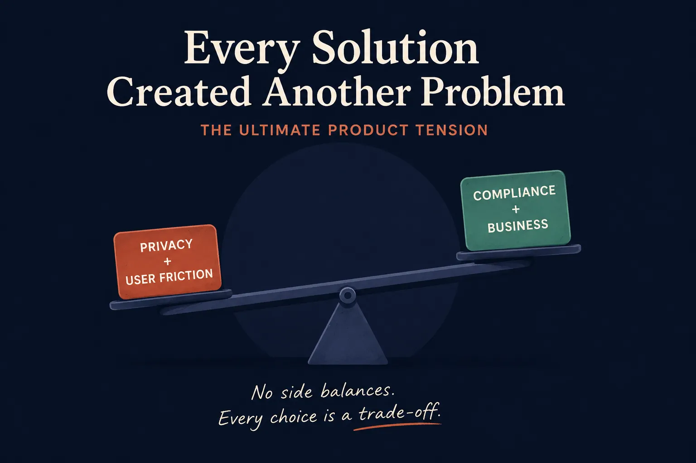

I remember exactly where I got stuck. Not on a hard technical bug, not on a line of code. It was one sentence I kept writing and crossing out in my notebook:

> The deceptive question that started the entire discovery process.

It sounds like a simple design question. It isn't. It's actually two questions pretending to be one, and for the first couple of days I didn't notice.

I picked YouTube India as something to think through: specifically, what it would take to make it compliant with India's new child-privacy law for users under 18. My brain, being an engineer's brain first and a product brain a distant second, did what engineers do. It went straight to *how do we verify*, without stopping to ask whether that was even the right question.

A quick note on DPDP, if you haven't run into it: it's India's Digital Personal Data Protection Act. The part that matters here is blunt. If a platform can't get verifiable consent from an actual parent, it's not allowed to process a child's data at all: no personalization, no behavioral tracking, no exceptions. Read plainly, that's not a UX problem. It's a legal wall with a UX problem standing in front of it.

## The Idea That Felt Obviously Right

Give everyone an Aadhaar check. Done: verified identity, verified age, verified everything.

I sat with that idea for maybe half a day feeling pretty good about myself. Then I actually read what DPDP asks for, instead of assuming I already knew, and the ground moved a little.

The catch, once you sit with it: to reliably prove a child is a minor, you usually need to collect *more* identifying information about them, or route through a parent's government ID. So the fix for "we're not protecting children's data enough" becomes "collect a lot more data, including a parent's identity documents, to prove we're protecting it." The cure and the disease start looking identical.

Okay, fine, DigiLocker instead of raw Aadhaar. Cleaner, government-backed, less scary. Except it still means an adult has to stop, open another app, authenticate, and hand something over before a teenager can press play. Nobody drops what they're doing on a Tuesday evening to complete a multi-step ID check so their kid can watch a video.

What about facial age estimation, where a camera guesses your age and no ID is needed? I liked this one for about a day, right up until I ran into how unreliable those models are exactly where it matters most (13 versus 16), and how uncomfortable it feels to point a camera at a child's face just to let them watch YouTube.

Behavioral signals, then. Quietly inferring age from watch history and session patterns. This is the one that stung the most, because it doesn't *look* invasive. No form, no camera, no upload. But it's still profiling a minor to make a judgment about them, which is exactly what the law calls "prohibited processing." I'd found a way to violate data minimization while feeling like I hadn't touched anything.

Four ideas. Four different ways of failing.

## Realizing I Was Asking the Wrong Question

Somewhere around here I stopped writing "how do we verify everyone" and started writing something closer to: **how do we protect children while spending as little trust and friction as possible to do it?**

What "discovery" actually means, if nobody's explained it to you: it isn't researching to confirm your first idea. It's the process that's supposed to *break* your first idea, ideally before you've built anything. Mine broke four times before I stopped treating age verification as a single gate and started treating it as a spectrum of confidence, where most people don't need the strict version and only a flagged minority do.

To actually convince myself, I scored the three real options I was choosing between (trust everyone's self-declared age, verify everyone up front, or something in between) against the things that mattered: trust, friction, compliance, engineering cost, privacy, business impact, scalability.

Laid out like that, it stopped being a debate. Self-declared alone fails the law. Verifying everyone fails the user and quietly kills the business. The hybrid is the only row that doesn't collapse somewhere.

## Building the Tiered System

Instead of one hard checkpoint, I sketched something in layers:

- **🔹 Tier 0 — Self-Declared Age.** Low friction, standard entry point, but gameable on its own.
- **🔸 Tier 1 — Passive Behavioral Signals.** An invisible safety net. Not tracking to build an ad profile, but analyzing activity anomalies to flag potential minors.
- **🚀 Tier 2 — Parent-Anchored Verification.** The high-confidence fallback. Only triggered for flagged accounts, routing validation securely through an existing guardian or DigiLocker.

Most people never touch the expensive part of the system. The friction goes exactly where the risk is, and nowhere else.

I mocked up the actual flow with two people in mind: a fifteen-year-old, and his mum on her own phone. He taps "ask a parent." She gets a notification, confirms she's an adult, confirms she's his guardian, picks what she's comfortable unlocking. The whole thing is designed to take under two minutes. And the part I'm quietly proud of: he's never told he was flagged. The detection stays invisible to him. Protection, not punishment.

## The Trade-Off I Didn't Expect to Accept

The part I didn't see coming until I was almost done: I kept wanting a version where nobody loses anything. There isn't one. There's no clever fourth option that dissolves the tension.

At some point I had to write down, plainly, that a teenager on this system gets a slightly less personalized, less autonomous experience than he'd otherwise get, permanently, on the ad-targeting side, and that this isn't a bug to optimize away later. It's the actual cost of the decision. Pretending both sides come out equally happy would have been the dishonest version of this project.

Something I hadn't separated before this project: you can A/B test how a screen *looks*, what the copy says, where the confirm button sits. You cannot A/B test whether a child gets protected. That's not a variable to optimize. It's a floor.

## Measuring Something You Can't Fake by Looking Away

Two kinds of metric, and why the difference matters here: a **north star metric** is the one number that says whether things are working overall. A **guardrail metric** is one that must never move in the wrong direction, no matter what the north star does. I set my north star as something like *protected minor coverage*, deliberately built so it couldn't quietly improve just because detection got worse. Alongside it, one guardrail had to read exactly zero: any leakage of prohibited processing on a flagged minor. Not "low." Zero.

It's tempting to pick a metric that can be nudged up simply by looking away from the problem harder. I'm not going to pretend I know if mine is the right one. I know I thought harder about *why it might be the wrong one* than I ever have before.

## What I Actually Walked Away With

I started this thinking product management was mostly about arriving at a good answer. I didn't expect that most of the actual work would be sitting with a bad idea long enough to understand *why* it was bad, and doing that four separate times before anything useful emerged.

Every solution I reached for created another problem. Verify more, and you collect more. Reduce friction, and you weaken compliance. Protect the child, and the teenager pays a small, real cost in autonomy. None of that resolved into something clean. It resolved into a decision about which trade-off I was willing to make, and being honest about what it cost.

Nobody tells you that part when they describe what this job actually is. The job isn't finding the answer. It's deciding which problem you'd rather live with.
