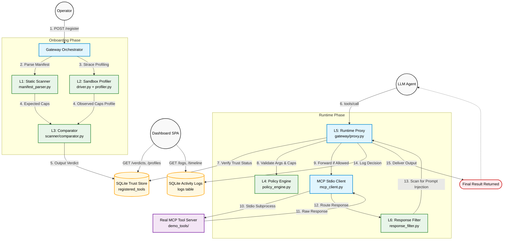

# MCP Zero-Trust Gateway Architecture Flow

Below is the comprehensive architectural flow diagram of the MCP Zero-Trust Gateway, visualizing how each module interacts to produce the final result.

The system is divided into two major phases:
1. **Onboarding Phase**: Triggered when a new tool is registered. It involves static scanning, sandbox profiling, and comparing observed behavior against expected declarations to store a trusted verdict.
2. **Runtime Phase**: Triggered when the LLM Agent calls a tool. It leverages the trust store, enforces live policies, forwards the call to the real tool, and filters the response before returning the final result to the agent.

### Flow Breakdown

**How we get the final result:**
1. **Tool Registration**: The `Operator` registers a tool with the `Gateway Orchestrator`.
2. **Dual Analysis**: The `Static Scanner (L1)` computes what the tool *should* do, while the `Sandbox Profiler (L2)` captures what the tool *actually* does at the system call level.
3. **Verdict Generation**: The `Comparator (L3)` calculates the delta (undeclared capabilities), assigns a severity, and saves a `Verdict` to the `SQLite Trust Store`.
4. **Agent Invocation**: The `LLM Agent` attempts to use the tool via the `Runtime Proxy (L5)`.
5. **Runtime Enforcement**: The Proxy immediately checks the `Trust Store`. If trusted, it passes the call to the `Policy Engine (L4)` to check against live baseline rules.
6. **Execution & Filtering**: If allowed, the `MCP Client` executes the real tool server. The raw response is caught and scanned by the `Response Filter (L6)` for malicious injections.
7. **Final Delivery**: After all checks pass and the event is written to the `Activity Logs`, the cleansed data flows back as the `Final Result` to the `LLM Agent`.